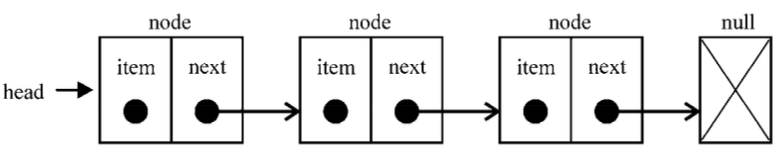
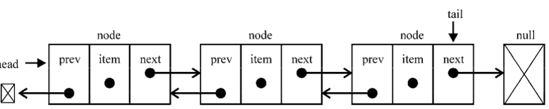
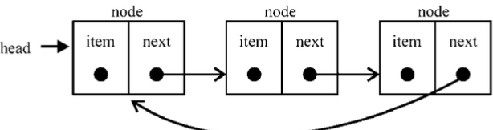

最近在复习数据结构和算法相关的东西，准备将链表，🌲等数据结构都用JS实现一哈，虽然作为一个前端程序猿平常用到的不多，但咱首先是个程序员，然后才是程序员，内功必须修炼好！fighting！

- 栈和队列的实现采用JS原生的Array方法已经可以完全模拟掉了，实现起来也比较简单，就不去专门实现一下了，不过代码中会包含，咱们就直接从链表这玩意开刀

- 链表优于数组的是它可以轻松的添加和移除项，它没有固定的长度

## 链表

- [链表](https://zh.wikipedia.org/wiki/%E9%93%BE%E8%A1%A8#%E6%8E%A5%E5%8F%A3%E5%AE%9E%E7%8E%B0)也是一种常见的数据结构，是一种线性表。
- 它和数组一样都可以存储多个元素，但是数组是存储有序的数据，而链表呢，**它所存储的是当前的值和下一个元素的指针**, 在js中理解的话就是它的每一项都是一个对象，该对象包含当前的值和另外一个对象，另外一个对象就它的下一项数据，以此类推，它便成为了链表。
- 值得注意的是，链表分为单向链表，循环链表，双向链表，还有其他的扩展型，咱们这里只讨论和实现这基础的三种。

### 单向链表

- 单向链表是最简单的一种链表，也是链表最基本的结构，它只包含两个域，一个信息域，一个指针域，单向链表的最后一项的下一个元素指向的是一个空值。
如下图所示:



### 双向链表

- 它区别于单向链表的是，除了包含当前的值和下一项的指针之外，它还包含上一项的指针，所以它是双向的。
- 需要注意的是，它的第一项的指向前一项的指针为空值,最后一项指向后一项的也是空值
如下图所示:


### 循环链表

- 从前面我们可以看到,无论单链表或者双链表，它们的首或尾都是有一个空节点，而循环链表则是将首尾串联了起来
如下图所示:



### 链表的使用场景

在开始实现链表之前，我们先考虑一下链表的使用场景，很遗憾在前端工作中，我不了解什么情况需要使用链表，而在其他领域要使用链表只需要满足
1. **数据**不是连续存放的,因为链表存储的是指针
2. 数据需要频繁插入和移除 (如果有大量的这种操作，性能相差会很大)
想来想去，比较直观的一个例子便是文件系统，满足上述条件，并且文件数据在硬盘不一定是连续存放
实际上链表还在很多底层有着应用，对于不需要搜索但变动频繁且无法预知数量上限的数据，它可以起很大的作用。
学习它虽然在工作中可能不一定会使用，但对于我们理解很多底层原理肯定会有帮助的。


### 单链表的实现

- 在上面我们已经介绍了单链表的结构，下面我们来实现一下
- 采用ES6语法，并使用了[WeakMap](https://developer.mozilla.org/zh-CN/docs/Web/JavaScript/Reference/Global_Objects/WeakMap)创建私有属性和共用该数据结构
- 代码如下，讲解写在注释中
- 注意事项：
	1. 创建WeakMap,防止每创建一个链表内部便创建一次length和head的变量,节省内存
	2. 链表操作完成，记得更新链表长度
	3. 记得判断越界情况，单链表索引是从0开始的
	4. 链表的循环边界：1. 长度 2. 最后一项的下一项指针为null

```javascript
	// 采用Es6语法模拟类

	let LinkedList = (function () {

			// 基础类，使用该类创建链表基础数据
		    class Node {
		        constructor(element){
		            this.element = element;
		            this.next = null;
		        }
		    }

		  
		    const length = new WeakMap();
		    const head = new WeakMap();

		    class LinkedList2 {

		        constructor () {
		            length.set(this, 0);  
		            head.set(this, null); 
		        }

		        append(element) {
		        	// 向链表插入一项
		            let node = new Node(element),
		                current;

		            if (this.getHead() === null) { // 如果时空链表，将该项变为head即可
		                head.set(this, node);
		            } else {

		                current = this.getHead();      
		                while (current.next) {  // 当最后一项变为null,说明已经到达链表尾部，将最后一项指向新的值完成插入
		                    current = current.next;
		                }
		                current.next = node;

		            }
		            let l = this.size();  //完成插入，更新链表长度
		            l++;
		            length.set(this, l);
		        }

		        insert(position, element) {
		        	// 链表越界判断
		            if (position >= 0 && position <= this.size()) {
		                let node = new Node(element),
		                    current = this.getHead(),
		                    previous,
		                    index = 0;

		                 // 如果是往首项插入，则将该项的下一项指针指向head,并将该项变为head即可
		                if (position === 0) { 
		                    node.next = current;
		                    head.set(this, node);
		                } else {
		                	// 如果是在中间位置插入,将前一项的指针指向新值，新值得指针指向原来的下一项
		                    while (index++ < position) {
		                        previous = current;
		                        current = current.next;
		                    }
		                    node.next = current;
		                    previous.next = node;
		                }
		                let l = this.size();  // 完成插入后，千万不要忘了更新长度哦
		                l++;
		                length.set(this, l);
		                return true;
		            } else {
		                return false;
		            }
		        }

		        removeAt(position) {
		            if (position > -1 && position < this.size()) {

		                let current = this.getHead(),
		                    previous,
		                    index = 0;
		                 // 断开指针的关联，然后更新长度，则可以很轻松的实现指针的移除
		                if (position === 0) {
		                    head.set(this, current.next);
		                } else {
		                    while (index++ < position) {
		                        previous = current;
		                        current = current.next;
		                    }
		                    previous.next = current.next;
		                }
		                let l = this.size();
		                l--;
		                length.set(this, l);
		                return current.element;

		            } else {
		                return null;
		            }
		        }

		        remove(element) {
		        	// 循环判断出该值的位置，再移除
		            let index = this.indexOf(element);
		            return this.removeAt(index);
		        }

		        indexOf(element) {

		            let current = this.getHead(),
		                index = 0;
		            // 循环比较出，指针的位置
		            while (current) {
		                if (element === current.element) {
		                    return index;
		                }
		                index++;
		                current = current.next;
		            }

		            return -1;
		        }

		        isEmpty() {
		            return this.size() === 0;
		        }

		        size() {
		            return length.get(this);
		        }

		        getHead() {
		            return head.get(this);
		        }

		        toString() {

		            let current = this.getHead(),
		                string = '';

		            while (current) {
		                string += current.element + (current.next ? ', ' : '');
		                current = current.next;
		            }
		            return string;

		        }

		        print() {
		            console.log(this.toString());
		        }
		    }

		    return LinkedList;
})();

```

### 总结

- 通过了解链表的基本概念和实现单链表，对链表有了基础的了解，由于个人水平有限，难免有错误，在以后涉猎别的方面的知识时可以多多思考链表相比于其他数据结构的优点加深理解。
- 代码地址：
	1. [单链表]() 
	2. [单链表]()
	3. [单链表]()


