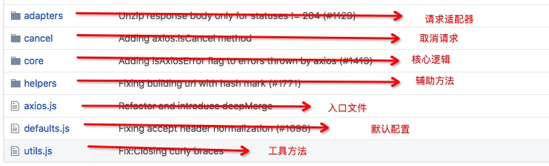
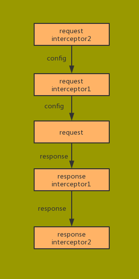
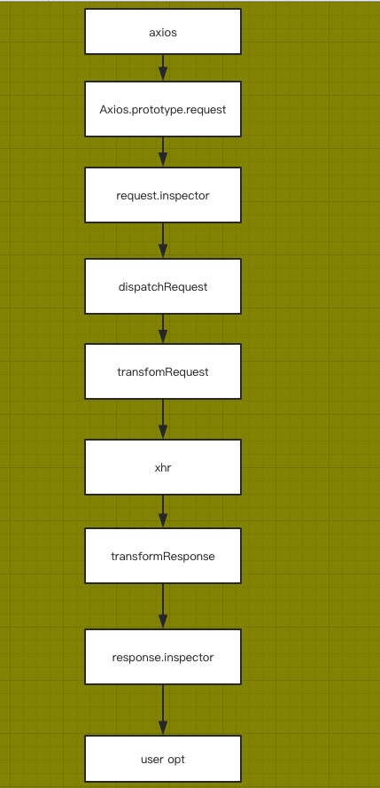

## Axios简介

  基于Promise的HTTP客户端，用于浏览器和node.js

- 支持浏览器端 `ajax` 请求
- 支持从 `node.js` 发出http请求
- 支持 `Promise API`
- 支持拦截请求和响应
- 转换请求和响应数据
- 取消请求
- 自动转换JSON数据
- 客户端支持防范XSRF

## 源码目录介绍



## 源码架构

- 创建一个 `Axios` 构造函数，添加默认配置，拦截器，原型上挂载请求方法

```javascript
  // core/axios.js
  // 构造Axios构造函数
  function Axios(instanceConfig) {
    this.defaults = instanceConfig;
    // 添加拦截器
    this.interceptors = {
      request: new InterceptorManager(),
      response: new InterceptorManager()
    };
  }
  // 实际请求方法
  Axios.prototype.request = function() {};
  Axios.prototype.getUri = function() {};

  // 没有请求体 delete get head options
  Axios.prototype.get = function(url, config = {}) {
    return this.request(Object.assign(config, {
      method: 'get',
      url
    }))
  };

  // 有请求体 post put patch
  Axios.prototype.post = function(url, data, config = {}) {
    return this.request(Object.assign(config, {
      method: 'post',
      url,
      data
    }))
  };
```

- 实例化一个`Axios`实例`context`，接着创建`instance`指向`Axios.prototype.request`方法，并绑定了上下文`context`；
- 通过`extend`方法把`context`中的原型方法和实例方法全部拷贝到`instance`上 ，返回`instance`
- 创建一个默认实例，挂载快捷方法`create`,`CancelToken`,`all`等方法

```javascript
  // axios.js
  // 创建一个Axios实例，挂载辅助方法，并导出该混合对象
  function createInstance(defaultConfig = {}) {
    var context = new Axios(defaultConfig);
    var instance = bind(Axios.prototype.request, context);
    // Copy axios.prototype to instance
    utils.extend(instance, Axios.prototype, context)
    // copy context to instance
    utils.extend(instance, context)
    return intance
  }
  // create the default instance to be exported
  var axios = createInstance({})
  axios.Axios = Axios
  axios.create= function(config) {
    return createInstance(Object.assign(axios.defaults, config))
  }
  // 取消请求
  axios.Cancel = require('./cancel/Cancel')
  axios.CancelToken = require('./cancel/CancelToken')
  axios.isCancel = require('./cancel/isCancel')

  // Prmoise.all 的语法糖
  axios.all = Promise.all
  axios.spread = require('./helpers/spread')
```


## 🤔 如何实现 `axios` 所支持的的功能

### 支持 `Node` 和 `浏览器` 端的 `http` 请求

- 关键代码
  - [lib/adpters](https://github.com/axios/axios/tree/master/lib/adapters)
  - [lib/defaults.js](https://github.com/axios/axios/blob/master/lib/defaults.js)

- 原理介绍
  - 通过 `process` 区分出 `Node` 环境和浏览器环境
  - 浏览器环境使用 `XMLHttpRquest` 发起http请求，Node环境使用`http`，`https` 模块发起请求
  - 通过 `Promise` 包装实现请求方法

### 请求响应拦截器

- 关键代码
  - lib/core/InterceptorManager.js 
  - lib/core/Axio.js

- 拦截器运行示意



```javascript
  Promise
  .then(request[1].fulfilled, request[1].rejected)
  .then(request[0].fulfilled, request[1].rejected)
  .then(dispatchRequest, undefined)
  .then(response[0].fulfilled, response[0].rejected)
  .then(response[1].fulfilled, response[1].rejected)
  .then() // user opt
```

- 原理介绍
  - 实现一个拦截器类中维护一个数组，添加拦截器方法 `use` , 移除拦截器方法 `eject`,
  遍历拦截器方法 `forEach`
  - 利用数组 `unshift`, `push` 方法，添加请求拦截器和响应拦截器
  - 利用 `Promise.then` 链式调用添加的拦截器

如果大家有了解过`Koa`的中间件原理，可能会发现很相似


### 转换请求和响应数据

- 关键代码
  - [lib/core/transformData.js](https://github.com/axios/axios/blob/master/lib/core/transformData.js)
  - [lib/default.js](https://github.com/axios/axios/blob/master/lib/defaults.js)

- 原理介绍
  
  - 默认配置中内置默认 `transformRequest`, `transformResponse` 方法，处理常见情况
  - 编写`transformData` 方法，遍历多个转换器，处理数据
```javascript
  function transformData(data, headers, fns) {
    /*eslint no-param-reassign:0*/
    utils.forEach(fns, function transform(fn) {
      data = fn(data, headers);
    });

    return data;
  };
```
  - `dispatchRequest` 请求前，调用 `transformData` 调用所有的请求转化器处理请求数据
  -  请求完成后，调用 `transformData` 调用所有的响应转化器处理响应数据

### 取消请求

- 关键代码
  - [lib/cancel/CancelToken.js](https://github.com/axios/axios/blob/master/lib/cancel/CancelToken.js)
  - [lib/adpters/xhr.js](https://github.com/axios/axios/blob/master/lib/adapters/xhr.js)

- 原理介绍
  - 创建一个 `CancelToken` 构造函数接受一个 `executor` 函数，内部实例化一个 `pending` 状态的 `Promise` 对象，然后用一个 `resolvePromise` 变量指向 `resolve` 函数。
  - 接着执行 executor 函数，传入一个 `cancel` 函数，在 `cancel` 函数内部，会调用 `resolvePromise` 把 `Promise` 对象从 `pending` 状态变为 `resolved` 状态。
  - 在 `request` 请求中的 `resolvePromise.then` 被执行


### 客户端支持防范 `XSRF`

- XSRF介绍

  

- 防范方法
  - 验证请求 `referer`, 但由于 `referer` 也可以伪造，作用有限
  - 服务器端生成 `token`，并通过 `set-cookie` 的方式种到客户端，然后客户端发送请求的时候，从 `cookie` 中对应的字段读取出 `token`，然后添加到请求 `headers` 中。由于这个 `token` 比较难伪造，所以就能区分这个请求是否是用户正常发起的。

- 关键代码
  - [lib/helpers/isURLSameOrigin.js](https://github.com/axios/axios/blob/master/lib/helpers/isURLSameOrigin.js)
  - [lib/adpters/xhr.js](https://github.com/axios/axios/blob/master/lib/adapters/xhr.js)

- 原理介绍

  - 首先判断如果是配置 `withCredentials` 为 `true` 或者是同域请求，我们才会请求 `headers` 添加 `xsrf` 相关的字段。
  - 如果判断成功，尝试从 `cookie` 中读取 `xsrf` 的 `token` 值。
  - 如果能读到，则把它添加到请求 `headers` 的 `xsrf` 相关字段中。

## 完整流程



## 如何开发一个 `Axios` 这样的开源工具库

  - 需求分析，例如 `Axios` 支持的 `feature`，就是需求分析
  - 项目搭建，完整的构建发布流程和完备测试case可以增加开发效率和信任度， `Axios` 采用 `grunt` 构建 (现在更多会选择 `webpack`, `rollup`, `parcel` 等)，并具有完备的测试，示例代码。
  - API 设计，确定需求之后，一定要花时间设计友好，易用的API， `Axios` 就有多种多样的使用方式，足够灵活。
  - 实际编码，这部分可能是花时间最少的哦😯~
  - 完整的测试用例和示例，`Axios` 的测试case非常之多，`example` 下的示例代码也很丰富
  - 详细的文档，列出使用的方法，可能存在的问题，
  - issue 模板，方便用户反馈使用中的问题

## 结语

  阅读社区优秀的源码，有助于开拓视野，做到知其所以然，遇到问题才能轻松解决~

- 转载请注明[原文地址](http://cheerylong.site/blog/2019/06/02/axios源码浅析/)


