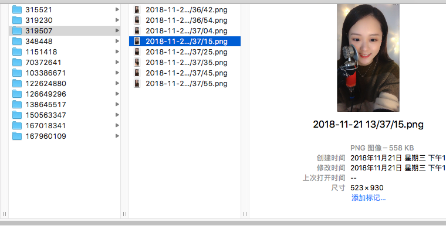

前几天有个同学问起如何实现自动截取直播间的图片，分析直播内容，当时就想到了用无头浏览器实现。正好之前了解过 [Puppeteer](https://github.com/GoogleChrome/puppeteer/) 推荐他使用了该工具，后来他用类似的 [Pyppeteer](https://github.com/miyakogi/pyppeteer) 实现了该需求，出于好奇我使用 `Puppeteer` 也实现了一版，也顺便过了一遍 [puppeteer](https://zhaoqize.github.io/puppeteer-api-zh_CN/) 得文档，仔细了解了一下它的各个功能，作此文总结。

## Puppeteer介绍

`Puppeteer` 是一个 `Node` 库，它提供 `API` 来通过 `DevTool` [协议](https://chromedevtools.github.io/devtools-protocol/)  控制 `Chromium/Chrome` 所以一般也称它为 `无头浏览器`，它有几个关键概念:

- Browser 
	
	想想我们操作浏览器时，一般会首先打开一个浏览器，`Browser` 就代表 `Puppteer` 通过 `DeveTool` 协议 操作的浏览器，它拥有浏览器上下文，我们可以打开它，关闭它，等各种操作，一般这也是我们使用 `Puppteer`的第一步。

- Page

	`Page` 代表一个页面框架，可以简单理解为前端概念的页面，它其中有一个主框架，也可以包括很多其它的框架，类似于 `iframe` 概念，我们打开浏览器要操作具体的一个页面，就必须使用到 `Page` 可以对它模拟各种行为，例如点击，选中，甚至在其中执行 `JavaScript` 插入css等操作。当然它是依赖 `Browser` 的。

- Frame

	页面框架，熟悉 `HTML` 的朋友一定了解，一个html文档是可以包含多个 frame的，里面都一个独立的浏览上下文, 通过 `Frame` , `Puppteer`可以操作页面中的框架

## 关键API介绍

下面介绍几个关键 `api` 实现各种特定功能时，根据👆的模块，去对应的文档找提供的 `api` 即可。


- [Puppteer.launch](https://zhaoqize.github.io/puppeteer-api-zh_CN/#/class-Puppeteer?id=puppeteerlaunchoptions)

  通过该 `api` 可以加载一个浏览器示例，可以指定使用自己本地的浏览器

````javascript
    const browser = await puppeteer.launch({
        headless: true,
        executablePath: '/Applications/Google Chrome.app/Contents/MacOS/Google Chrome',
        slowMo: 100,
        args: []
    });

````

- [browser.newPage](https://zhaoqize.github.io/puppeteer-api-zh_CN/#/class-Browser?id=browsernewpage)

  打开一个浏览器后，可以使用该 api 打开一个窗口，如果有需要打开多个页面的需求，最好在一个浏览器实例中打开，节省内存，如果不使用该窗口了及时使用`browser.close()` 关闭浏览器窗口。

- [page.viewport](https://zhaoqize.github.io/puppeteer-api-zh_CN/#/class-Page?id=pageviewport)

	可以通过该方法指定窗口的大小，查看页面加载情况。


- [page.waitFor](https://zhaoqize.github.io/puppeteer-api-zh_CN/#/class-Page?id=pagewaitforselectororfunctionortimeout-options-args)

	等待一定时间执行操作，有很多耗时的操作，例如视频加载等等，常常需要使用该方法，需要注意的时，`page` 虽然也可以监听一些类似 `load` 这样的事件，但是有些无法监听到的耗时情况，还是只能使用 `waitFor` 实现


- [page.goto](https://zhaoqize.github.io/puppeteer-api-zh_CN/#/class-Page?id=pagegotourl-options)

	导航到一个地址

- [page.$](https://zhaoqize.github.io/puppeteer-api-zh_CN/#/class-Page?id=pageselector)

	同 `document.querySelector()`

- [page.$$](https://zhaoqize.github.io/puppeteer-api-zh_CN/#/class-Page?id=pageselector-1)
	
	同 `document.querySelectorAll()`

- [page.$eval](https://zhaoqize.github.io/puppeteer-api-zh_CN/#/class-Page?id=pageevalselector-pagefunction-args-1)

	`document.querySelector` 选择 `dom` 节点，第二个参数接收一个函数，在浏览器上下文执行(因为是在浏览器环境执行，在此处打日志，并不会体现在控制台),返回执行结果

- [page.$$eval](https://zhaoqize.github.io/puppeteer-api-zh_CN/#/class-Page?id=pageevalselector-pagefunction-args)

	`document.querySelectorAll` 选择 `dom` 节点list，第二个参数接收一个函数，在浏览器上下文执行(因为是在浏览器环境执行，在此处打日志，并不会体现在控制台),返回执行结果


- [page.screenshot](https://zhaoqize.github.io/puppeteer-api-zh_CN/#/class-Page?id=pagescreenshotoptions)

	执行截图操作，该方法可以配置截取位置等属性，可以灵活选择


- [page.click](https://zhaoqize.github.io/puppeteer-api-zh_CN/#/class-Page?id=pageclickselector-options)

	触发元素的 `click` 事件


- [page.close](https://zhaoqize.github.io/puppeteer-api-zh_CN/#/class-Page?id=pagecloseoptions)

	关闭窗口，如果页面不使用了，一定要及时关闭


## 实战: 截取直播平台直播画面

### 需求分析
	
  打开某一个直播平台，拿到所有的直播间地址，分别访问该直播间，循环截取该直播间画面，保存图片到某一个地址。
	
### 实现逻辑

  1. 通过 `Puppteer` 实例化一个 `browser`,打开直播平台首页，拿到所有直播链接，房间号。

  2. 通过 `browser` 和刚刚拿到的直播链接循环打开多个 `Page` 加载直播间。

  3. 等待直播间加载完成，隔一定时间循环截图即可。

  4. 保存图片至指定文件夹

  看逻辑分析还是蛮简单的，下面是实现代码，完整代码我也上传到了[github](https://github.com/cheerylong/liveRoom_screenShot)

### 代码实现


#### 获取直播间链接

这一块用到了 `page.$$eval` 从直播主页上爬取直播间链接 并且返回链接列表

````javascript

/**
 * 获取房间链接列表
 * @Author   cheerylong
 * @DateTime 2018-11-21
 * @return   {[type]}   [description]
 */
async function getRoomList(homePage) {
    return await homePage.$$eval('.m-lc1Dft-YP9>a', (rooms = []) => {
        let urls = [];
        rooms.forEach(room => {
            urls.push(room.href);
        });
        return urls
    })
}


````

#### 循环打开直播间

 在页面 `domContentloaded` 后，我们用上一步拿到的房间链接**循环**打开页面去截图，需要注意的是同一个浏览器打开的直播窗口过多，后续的直播间就无法加载出来（原因目前为止，猜测是网络原因）。所以如果浏览器打开窗口达到设置的上限需要新开浏览器。


````javascript

    let browser = await puppeteer.launch(launchConfig);
    const homePage = await browser.newPage();

    // 获取首页所有直播间链接
    homePage.once('domcontentloaded', async () => {

        console.log('直播首页加载完成');

        await homePage.waitFor(1000);
        let roomList = await getRoomList(homePage)

        console.log('所有直播间:' + roomList);

        for (let num = 0; num < roomList.length; num++) {
            if (((num + 1) % openedNum) === 1 && num !== 0) {
                // 打开定量窗口后 新开一个浏览器
                browser = await puppeteer.launch(launchConfig);
            }
            let page = await browser.newPage()
            handleRoomScreenShot(page, roomList[num], browser, (num && ((num + 1) % openedNum === 0)), num);
        }
    })
    await homePage.goto(homeHost, {
        waitUntil: ['domcontentloaded']
    })


````

#### 截图并保存


这一步，我们已经进入直播间，等待一定时间等直播加载出现，准备开始截图。为了准确的截到直播界面，我们需要通过 `page.$eval` 拿到直播画面的位置信息再进行截图保存，保存之前需要先检测保存目录是否存在，我这里命名是以房间号命名，以时间戳为文件名。

````javascript

/**
 * 处理直播间截图
 * @Author   cheerylong
 * @DateTime 2018-11-20
 * @param    {[type]}   page     [description]
 * @param    {[type]}   roomLink [description]
 * @return   {[type]}            [description]
 */
async function handleRoomScreenShot(page, roomLink, browser, isEnd, num) {
    let roomId = getRoomId(roomLink);
    createDir(roomId);
    await page.setViewport({ width: 1920, height: 1080 })
    await page.goto(roomLink, { waitUntil: ['domcontentloaded'] });
    await page.waitFor(loadingTime)
    await page.click('#lvp_player_private_portal_id_private > div > i') // 点击播放按钮
    await page.waitFor(playBtnShowTime)
    // 获取直播画面位置信息
    let videoInfo = await page.$eval('.m-lvp-container>video', (el) => {
        return {
            x: el.getBoundingClientRect().x,
            y: el.getBoundingClientRect().y,
            width: el.getBoundingClientRect().width,
            height: el.getBoundingClientRect().height
        }
    });

    console.log('位置信息: ');
    console.log(videoInfo);

    await page.screenshot({
        path: `screenshot/${roomId}/${Date.now()}.png`,
        clip: videoInfo
    });

    if (isLoop) {
        setInterval(async () => {
            await page.screenshot({
                path: `screenshot/${roomId}/${Date.now()}.png`,
                clip: videoInfo
            });
        }, loopTime)
    } else {
        await page.close();
        if (isEnd) {
            await browser.close();
        }
    }
};

````


抓取后的截图，按房间号分开保存：



## 总结

 了解了 `Puppeteer` 的几个核心模块之后，就可以做一些简单的小程序了，例如爬虫，截图，保存图片到本地等等。直接到对应的功能模块去查找`API` 也很方便，值得注意的是 `Puppeteer` 还不是很成熟，如果要用到生产环境的需要慎重一些。
 另外，提供的demo程序也仅供参考，有很多容错和可用性出于方便都考虑的不是很多。
 总的而言， `Puppeteer` 可以实现很多好玩的东西，有空的话可以多多探索哦！


