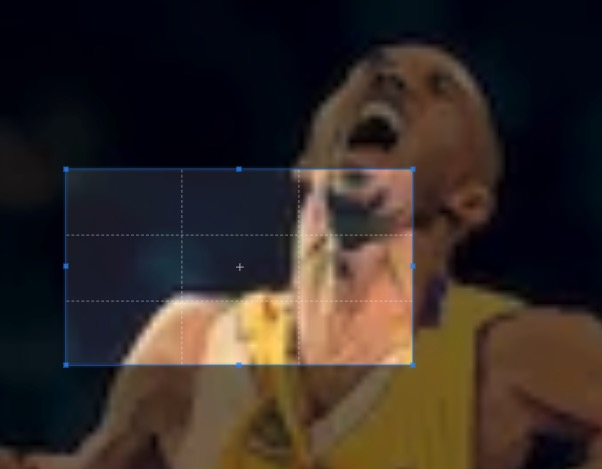

## 前言

图片上传对于web开发者来说应该都不会陌生，非常常见的一个需求，此文总结一下常见的几种图片上传需求和实现方式~

## 常见图片处理需求


### 图片剪裁

这种需求非常常见，对操作者很友好，他们即使不具备处理图片的能力也可以通过页面的功能对图片进行裁剪，一般是像下图，有个选择框可以截取一部分图片内容然后选择上传

实现这种需求其实也非常简单，这里说下基本原理:

- 实现一个选定工具，圈定选择区域，监听鼠标事件实现移动，拉伸功能
- 选择好截取区域后（拿过圈定的位置数据top,left,width,height），通过一个隐藏的 `canvas` 元素，利用 [drawImage](https://developer.mozilla.org/zh-CN/docs/Web/API/CanvasRenderingContext2D/drawImage) 方法将圈定的图片区域绘制在 `canvas` 上
- 通过 [toDataURL](https://developer.mozilla.org/en-US/docs/Web/API/HTMLCanvasElement/toDataURL) 拿到图片数据进行处理（展示，上传）

这里推荐笔者使用过的几个好用的工具库处理这种需求

- [cropperjs](https://github.com/fengyuanchen/cropperjs)
- [jquery-cropper](https://github.com/fengyuanchen/jquery-cropper)
- [vue-cropper](https://github.com/xyxiao001/vue-cropper)
- [react-cropper](https://github.com/roadmanfong/react-cropper)

### 图片压缩

图片压缩一般在移动端上传图片使用较多，为了节省服务器资源，提升上传速度，客户端对图片进行压缩上传。

- 基本原理

  采用上面提到的[toDataURL](https://developer.mozilla.org/en-US/docs/Web/API/HTMLCanvasElement/toDataURL)方法，对绘制到canvas上的图片进行要锁，`toDataURL` 方法接受两个参数，一个参数是文件类型默认为PNG格式，第二个参数便是图片质量，可选范围0~1，默认0.92，如果超出范围会使用默认值，需要注意的是在指定图片格式为`image/jpeg`或`image/webp`的情况下才可以选择压缩参数

这里推荐[localResizeIMG](https://github.com/think2011/localResizeIMG)这个工具库来处理


### 图片拖拽上传

拖拽上传这个功能虽说不是必须的，算是锦上添花，有些场景会很方便提高用户体验，而且实现成本也不是很高，建议上传流程中加入此功能。

- 基本原理

  监听元素的 `ondrop` 事件，通过[DataTransfer](https://developer.mozilla.org/zh-CN/docs/Web/API/DataTransfer)拿到拖拽内容，进行遍历查找到图片文件再进行上传等处理。这里需要注意的是 **需要阻止拖动时的默认行为，不然会直接在浏览器打开该文件**

- 示例代码

```javascript

// 在内部移动时阻止默认事件
dropEle.ondragover=function(e){
  e.preventDefault();
}

// 拖拽上传
dropEle.ondrop = function(e) {
  e.preventDefault();
  // 获取拖过来的文件
  const fs = e.dataTransfer.files;
  const len = fs.length; // 获取文件个数
  for(let i=0; i<len; i++){
      const _type = fs[i].type;
      if(_type.indexOf("image")!== -1){// 判断他是不是图片文件
          const fd = new FileReader();
          fd.readAsDataURL(fs[i]);
          fd.onload=function(e){
            const formData =  new FormData()
            formData.append('imgData', e.target.result)
            axios({
              method: 'post',
              url: '/upload',
              data: formData
            })
          }
      }
  }
}

```

### 从剪切板复制图片

跟拖拽文件一样，直接粘贴一张图片就可以上传，也是可以提高用户体验的哦，推荐支持，下面就告诉你方法啦😸~

- 基本原理

  监听元素的[paste](https://developer.mozilla.org/en-US/docs/Web/API/Element/paste_event)事件，从事件对象中拿出剪切数据[clipboardData]()，遍历找到图片文件进行处理

- 示例代码

```javascript

ele.addEventListener('paste', function(event) {
  const items = (event.clipboardData && event.clipboardData.items) || [];
  let file = null;
  if (items && items.length) {
      for (let i = 0; i < items.length; i++) {
          if (items[i].type.indexOf('image') !== -1) {
              file = items[i].getAsFile();
              break;
          }
      }
  }
  const reader = new FileReader();
  reader.onload = function(e){
    const formData =  new FormData()
    formData.append('imgData', e.target.result)
    axios({
      method: 'post',
      url: '/upload',
      data: formData
    })

  }
  reader.readAsDataURL(file);
});

```

## 图片上传

上面介绍了几种常见的图片处理场景，处理完图片，拿到图片数据，我们再来看下有几种上传方法：

- 表单上传，这是最早的上传方式，利用input标签选择文件后发起表单请求上传，缺点是会导致页面刷新。
  - 实际上表单上传还有一种不刷新页面的姿势，那就是在页面中放置一个 `iframe` 在表单中设置 `target` 为该`iframe`便可以不刷新当前页面

- `FormData` 利用 `FormData` 构造表单数据，ajax提交，这种虽然提交的还是表单数据，但是通过ajax方式可以不刷新页面

```javascript

  const imgBaseData = canvas.toDataURL()
  const formData =  new FormData()
  formData.append('imgData', imgBaseData);
  ajax({
    method: 'post',
    url: 'http://localhost:3400/base/upload',
    data: formData
  })

```


- 直接利用ajax提交二进制文件数据

```javascript

  function base64Img2Blob(code){
    const parts = code.split(';base64,')
    const contentType = parts[0].split(':')[1]
    const raw = window.atob(parts[1])
    const rawLength = raw.length
    const uInt8Array = new Uint8Array(rawLength)
    for (let i = 0; i < rawLength; ++i) {
      uInt8Array[i] = raw.charCodeAt(i)
    }
    return new Blob([uInt8Array], {type: contentType})
  }
  const blobData = base64Img2Blob(canvas.toDataURL())
  ajax({
    method: 'post',
    url: '/base/buffer',
    data: blobData
  })


```

## 服务端处理文件上传

上面的几种上传方式笔者都曾使用过，服务端处理也是很简单的，接受对应的数据处理即可，这边给出笔者曾经用 `express` 写过的示例。

```javascript

const app = express()
const multiparty = require('multiparty')
const router = express.Router()

router.post('/upload', function(req, res) {
  var form = new multiparty.Form();
    form.parse(req, function(err, fields, files){
        //将前台传来的base64数据去掉前缀
        var imgData = fields.imgData[0].replace(/^data:image\/\w+;base64,/, '');

        var dataBuffer = new Buffer(imgData, 'base64');
        //写入文件
        fs.writeFile('imge2.png', dataBuffer, function(err){
            if(err){
                res.send(err);
            }else{
                res.json({msg: '保存成功'});
            }
        });

    });
})
app.use(router)
const port = process.env.PORT || 3400
app.listen(port, () => {
  console.log(`server listening on http://localhost:${port}`)
})


```